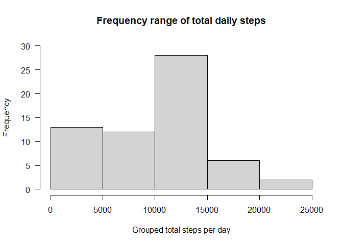
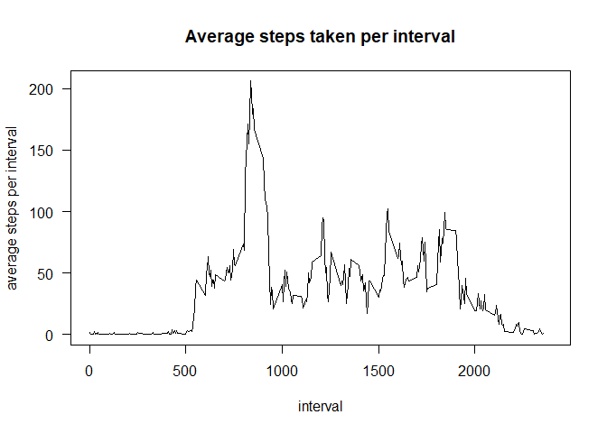
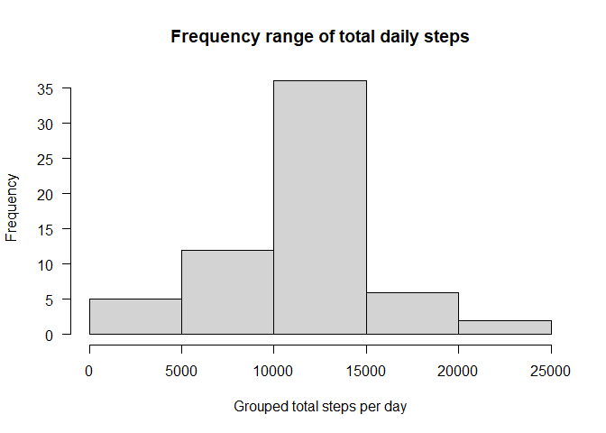
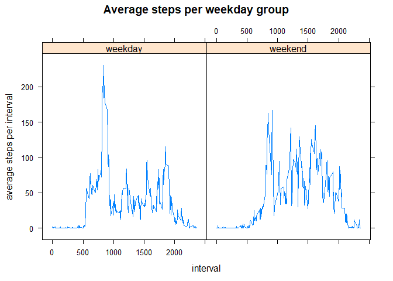

```r
activity <- read.csv("activity.csv")
library(dplyr)
```

```
## 
## Attaching package: 'dplyr'
```

```
## The following objects are masked from 'package:stats':
## 
##     filter, lag
```

```
## The following objects are masked from 'package:base':
## 
##     intersect, setdiff, setequal, union
```

```r
library(lattice)
```


```r
steps_sum <- summarize(group_by(activity, date), 
                          "total steps per day" = sum(steps, na.rm = TRUE))
```

```
## `summarise()` ungrouping output (override with `.groups` argument)
```


```r
hist(steps_sum$`total steps per day`, breaks = 4, ylim = c(0, 30),
     main = "Frequency range of total daily steps", las = 1, 
     xlab = "Grouped total steps per day")
```

<!-- -->


```r
mean(steps_sum$`total steps per day`)
```

```
## [1] 9354.23
```

```r
median(steps_sum$`total steps per day`)
```

```
## [1] 10395
```


```r
steps_mean <- summarize(group_by(activity, interval), 
                        "average steps per interval" = mean(steps, na.rm = TRUE))
```

```
## `summarise()` ungrouping output (override with `.groups` argument)
```


```r
plot(steps_mean, type = "l", xlim = c(0, 2400), 
     main = "Average steps taken per interval", las = 1)
```

<!-- -->


```r
steps_mean[which.max(steps_mean$`average steps per interval`),]
```

```
## # A tibble: 1 x 2
##   interval `average steps per interval`
##      <int>                        <dbl>
## 1      835                         206.
```

```r
sum(is.na(activity))
```

```
## [1] 2304
```


```r
activity2 <- activity
activity2$groupmeans <- steps_mean$`average steps per interval`
activity2$steps <- ifelse(is.na(activity2$steps), 
                          activity2$steps <- activity2$groupmeans, 
                          activity2$steps <- activity$steps)

steps_sum2 <- summarize(group_by(activity2, date), 
                       "total steps per day" = sum(steps, na.rm = TRUE))
```

```
## `summarise()` ungrouping output (override with `.groups` argument)
```


```r
hist(steps_sum2$`total steps per day`, breaks = 4,
     main = "Frequency range of total daily steps", las = 1, 
     xlab = "Grouped total steps per day")
```

<!-- -->


```r
mean(steps_sum2$`total steps per day`)
```

```
## [1] 10766.19
```

```r
median(steps_sum2$`total steps per day`)
```

```
## [1] 10766.19
```


```r
activity2$weekday <- weekdays(as.Date(activity2$date))
activity2$weekday2 <- "weekday"
activity2[activity2$weekday %in% c('Saturday', 'Sunday'),]$weekday2 <- "weekend"

steps_mean2 <- summarize(group_by(activity2, interval, weekday2), 
                        "average steps per interval" = mean(steps, na.rm = TRUE))
```

```
## `summarise()` regrouping output by 'interval' (override with `.groups` argument)
```


```r
xyplot(`average steps per interval` ~ interval|weekday2, data = steps_mean2, 
       type = "l", main = "Average steps per weekday group")
```

<!-- -->

